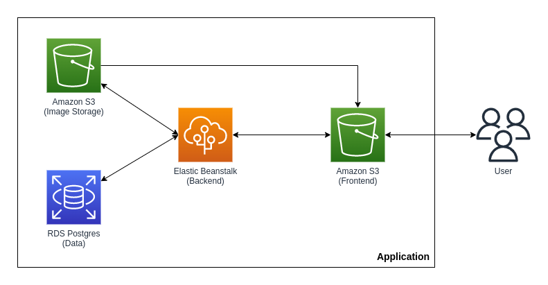

# Infrastructe

## Built With

- [AWS RDS](https://aws.amazon.com/rds/)
- [AWS S3](https://aws.amazon.com/s3/)
- [AWS Elastic Beanstalk](https://aws.amazon.com/elasticbeanstalk/)

## Infrastructure diagram

### Elements

- A S3 to host frontend.
- A Elastic Beanstalk to host backend.
- A RDS database running Postgres.
- A S3 bucket for hosting uploaded pictures.

### Description
1. Client connect to an S3 serving an compiled angular project.
2. The website send data to Elastic Beanstalk where backend is hosted.
3. Backend saves data about users and feed in RDS Postgres.
4. When an user creates a post, the image is saved in an S3 bucket and post metadata is saved on RDS Postgres.
5. To show the posts on the feed view, frontend request data from backend and this data has the specified url for each image.
