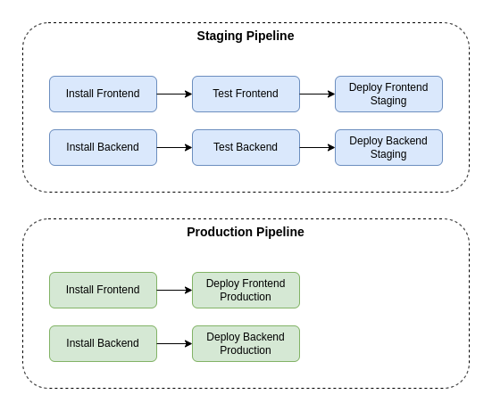

# Pipeline

## Built With

- [Github](https://github.com/)
- [CircleCI](https://circleci.com/)

## Pipeline Diagram

### Environments

The pipeline has two environments:

#### Staging

Runs after each push on a branch. It has install, tests and deploy, the merge depends on tests and deploy.
It is used to validate if code is passing on tests. Developers uses to validate the interface and manual tests.

#### Production

Runs after a merge on main. It has only install and deploy, tests are not needed since it is validate on branch before merge.
IT is used to install dependencies and deploy in production.

### Description

The configuration is defined on file [.circle/config.yml](../.circle/config.yml).
The pipeline is based on three types of jobs:

- **Install**: Install al dependencies to build and deploy.
- **Tests**: Run tests defined in package.json.
- **Deploy**: Deploy the frontend on s3 and backend in elastic beanstalk.
