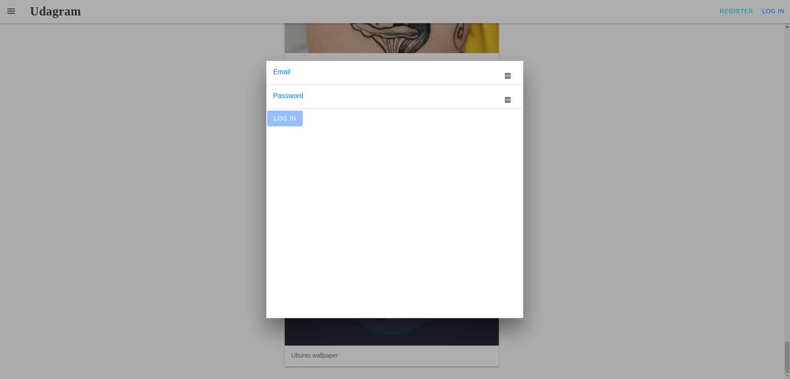

# Udagram

- [Udagram](#udagram)
  - [About The Project](#about-the-project)
  - [Built With](#built-with)
  - [Getting Started](#getting-started)
    - [Prerequisites](#prerequisites)
    - [Installation](#installation)
    - [Starting server:](#starting-server)
  - [License](#license)

## About The Project





Udagram is Angular application that allows users to post images to a feed and see all images on feed.

* In feed view is possible to view all posts.
* In create user view is possible to create a new user.
* In login view is possible to login with a created user.
* In crete post view is possible to post a new image.

## Built With

- [Angular](https://angular.io/) - Single Page Application Framework
- [Express](https://expressjs.com/) - Javascript API Framework
- [Node](https://nodejs.org) - Javascript Runtime
* [TypeScript](https://www.typescriptlang.org/)

## Getting Started

### Prerequisites

- Node v14.15.1 (LTS) or more recent. While older versions can work it is advisable to keep node to latest LTS version
- npm 6.14.8 (LTS) or more recent, Yarn can work but was not tested for this project
- Angular 13.0.3 or more recent
- Angular CLI 13.0.4 or more recent

### Installation

1. Install NPM packages
   ```sh
   npm install
   ```

### Starting server:

- Starting serve on port 4200
  ```bash
  npm run start
  ```

## License

[License](../LICENSE.txt)
